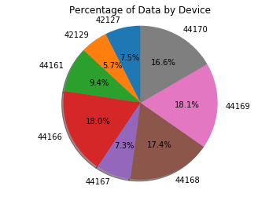

# Pig Data 
## Create Datatset using Pandas
Create Dataframe using **Pandas** python library create Data Frame


```python
import numpy as np
import pandas as pd
import matplotlib.pyplot as plt

df = pd.read_csv("N:\\Wild_Pig_Project\\GI_Combined_Test.csv")
list(df['Device_ID'].groupby(df['Device_ID']))

temp = df['Device_ID'].groupby(df['Device_ID']).count()
```

## Print List of Dataset by there Count Value
list below shows Device ID and Number of Datat points per Device


```python
print temp
```

    Device_ID
    42127    1956
    42129    1490
    44161    2474
    44166    4721
    44167    1921
    44168    4553
    44169    4745
    44170    4353
    Name: Device_ID, dtype: int64
    

## Pie Graph of Amount of Data by Device
Create Pie Graph of results **Based on List Above**


```python
temp.to_csv("N:\\Wild_Pig_Project\\Count_Pig.csv")
df = pd.read_csv("N:\\Wild_Pig_Project\\Count_Pig.csv", names=['Device_ID', 'Number_of_Points'])

#df.to_csv("N:\\Wild_Pig_Project\\Count_Pig.csv")
Dev = df.Device_ID.tolist()
Val = df.Number_of_Points.tolist()

fig1, ax1 = plt.subplots()
ax1.pie(Val, labels=Dev, autopct='%1.1f%%', shadow=True, startangle=90)
ax1.axis('equal')
plt.title('Percentage of Data by Device')
plt.show()
```





```python

```
